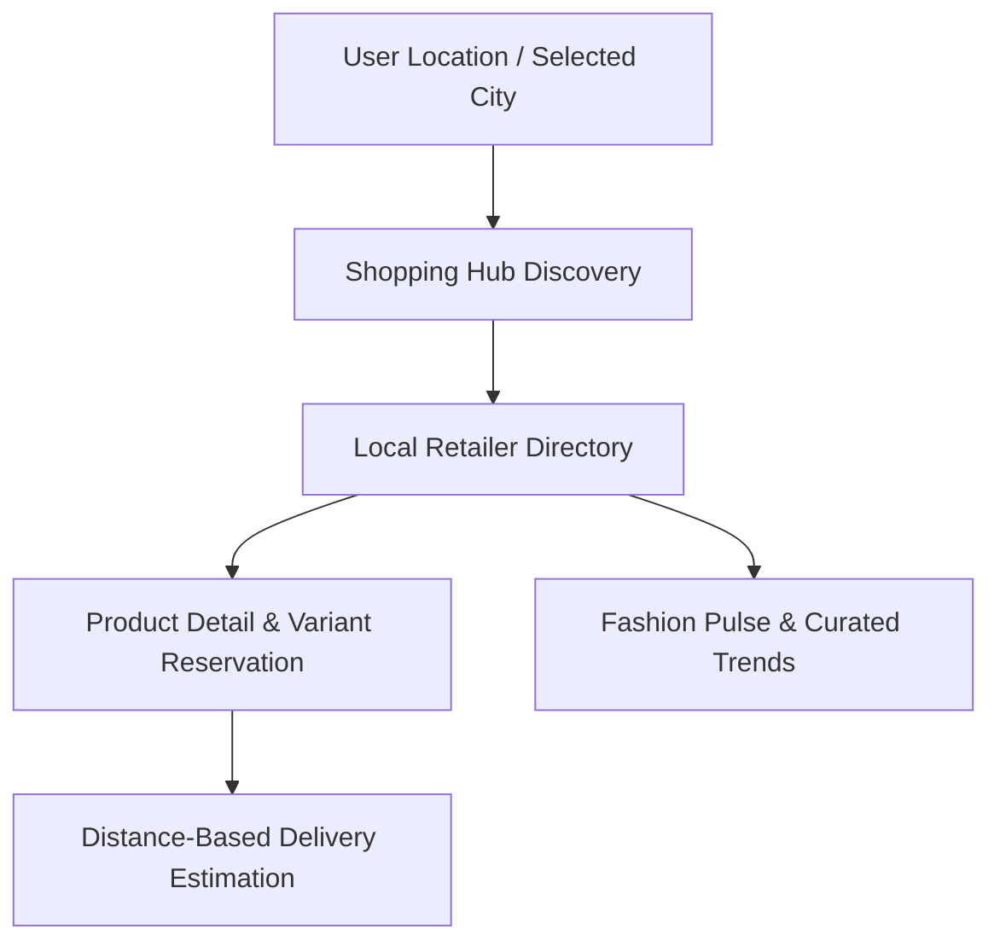
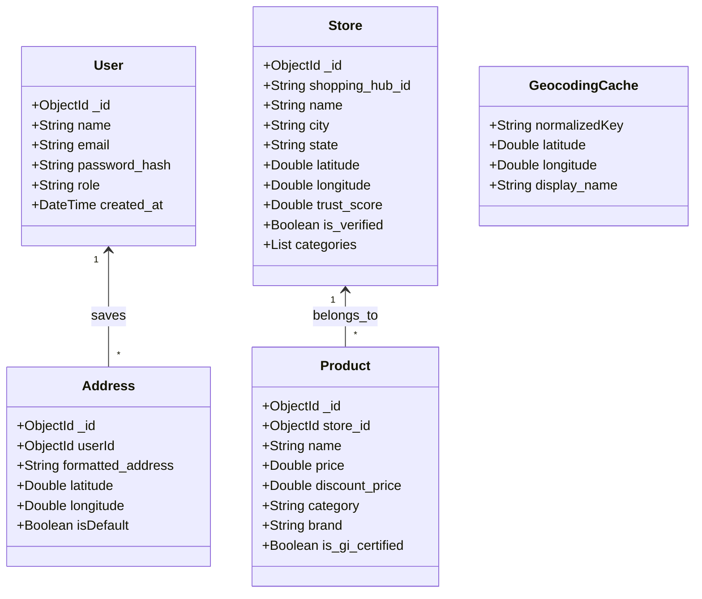

# Threads of Bharat: Empowering Trusted Regional Fashion Retailers

[](https://vitejs.dev/)
[](https://react.dev/)
[](https://tailwindcss.com/)
[](https://fastapi.tiangolo.com/)
[](https://www.mongodb.com/)
[](https://www.python.org/)

---

## 1. Project Overview
**Threads of Bharat** is a regional fashion discovery and e-commerce platform designed to bring offline, trusted regional fashion retailers into the digital ecosystem. Developed as an MVP for the Myntra Hackathon, this application bridges the digital divide for heritage craftsmanship and local shopping hubs. By digitizing iconic local boutiques and weaver cooperatives, it allows users to discover, search, and procure authentic regional fashion online, with proximity-based intelligence and delivery validations.

---

## 2. Theme / Problem Statement
### Theme: The Bharat Opportunity
In India, fashion is deeply regional, with distinct textiles, weaves, and styles native to different states (e.g., Kanjeevaram from Tamil Nadu, Pochampally from Telangana, Kasavu from Kerala). While consumers trust local regional retailers for their authenticity, quality, and heritage, these retailers possess **limited online visibility** and lack the tools to reach a global or city-wide digital audience. 

Conversely, online shoppers face a **trust gap** when buying regional garments, struggling to differentiate authentic weaves from replicas. **Threads of Bharat** solves this by establishing a digital catalog for verified local retail stores situated in recognized physical regional hubs, integrating location-based discovery, and verifying retailer credentials.

---

## 3. Product Solution



### Core Features & Technical Solutions:
*   **Trusted Regional Stores:** Promotes local physical retailers by highlighting their years in business, verification badges, and a custom **Trust Score** mapped from validation algorithms.
*   **Store Discovery:** Users discover stores based on their current geolocations, selected cities, or associated regional Indian states.
*   **Product Discovery:** Provides faceted catalog browsing (filtered by categories, gender, price, occasion, material, or fabric origin) alongside spell-corrected text search.
*   **Nearby Stores:** Locates physical boutiques in real-time, calculating distance matrices based on geocoding coordinate points.
*   **Fashion Pulse:** Highlights curated daily picks, visual backdrops (e.g., India Map explorer), regional spotlights, and fabric trends specific to selected regions.
*   **Store & Product Details:** Offers granular product insight, including active collections, inventory size-breakdowns, rating distributions, and product-specific details (such as Geographical Indication (GI) certification flags).
*   **Recommendation System:** Features a dual recommender module:
    1.  *Similar Products:* Cross-store suggestions based on category, sub-category, and material characteristics.
    2.  *Store Recommendations:* Curation of alternative catalog items from the same store page to retain customer interest.
*   **Online Shopping Experience:** Empowers customers with JWT-secured profile updates, delivery validation checks against active store radii, and address management capabilities.

---

## 4. Tech Stack

### Frontend
*   **Framework:** React 18 (Vite-powered single page application)
*   **Styling:** Tailwind CSS (utility-first UI engine) and CSS Custom Variables
*   **Animations:** Framer Motion (for fluid, sliding panel page transitions)
*   **Routing:** React Router v6 (declarative client-side routing)
*   **HTTP Client:** Axios (configured with intercepts for global authentication header injection)
*   **Location Rendering:** React Leaflet / Leaflet (interactive map representations)

### Backend
*   **API Framework:** FastAPI (Python-based ASGI framework utilizing asynchronous execution)
*   **Server Engine:** Uvicorn
*   **ODM / MongoDB Client:** Motor (asynchronous MongoDB driver)
*   **Validation:** Pydantic v2 (strict type enforcement & schemas validation)
*   **Authentication:** PyJWT / Jose (JSON Web Token token generation and verification)
*   **Security:** Passlib (Bcrypt algorithm for Blowfish-based password hashing)
*   **Geographical Services:** HTTPX (asynchronous client resolving coordinates via OpenStreetMap Nominatim APIs)

### Database
*   **Storage:** MongoDB (NoSQL document store optimized for geo-location geospatial indexes)

---

## 5. System Architecture
```
                               +-------------------------------------+
                               |           React Frontend            |
                               |          (Vite + Tailwind)          |
                               +------------------+------------------+
                                                  |
                                                  | REST APIs / Axios + JWT
                                                  v
                               +-------------------------------------+
                               |           FastAPI Gateway           |
                               |             (app/main.py)           |
                               +------------------+------------------+
                                                  |
                         +------------------------+------------------------+
                         |                        |                        |
                         v                        v                        v
             +-----------------------+ +----------------------+ +----------------------+
             |    Store/Geo Route    | |    Product Route     | |      Auth/Profile    |
             |  (app/routers/stores) | |(app/routers/products)| | (app/routers/auth)   |
             +-----------+-----------+ +----------+-----------+ +----------+-----------+
                         |                        |                        |
                         v                        v                        v
             +-----------------------+ +----------------------+ +----------------------+
             |   Geocoding Service   | |   Recommender Engine | |    Profile Service   |
             | (Nominatim Openmaps)  | | (app/services/recs)  | |(app/services/profile)|
             +-----------+-----------+ +----------+-----------+ +----------+-----------+
                         |                        |                        |
                         +------------------------+------------------------+
                                                  |
                                                  v  (Motor Async Driver)
                               +-------------------------------------+
                               |             MongoDB                 |
                               | (Stores, Products, Addresses, cache)|
                               +-------------------------------------+
```

### Architectural Flow:
1.  **Request Handling:** The client issues asynchronous `Axios` requests. If the route is JWT-secured, a request interceptor automatically attaches the authentication token retrieved from `localStorage`.
2.  **API Gateway Routing:** FastAPI processes requests through sub-routers. Authed requests are verified by a `get_current_user` dependency.
3.  **Service Interfaces:** Router controllers call isolated services:
    *   `GeocodingService` validates address coordinates via OpenStreetMap's Nominatim API, automatically buffering duplicate looks through a local cache (`geocoding_cache`).
    *   `ProductService` aggregates collections and triggers similarities calculations.
4.  **Database Layer:** Data transactions are performed asynchronously via `Motor`. Geolocational lookups use spatial coordinate pairs (`[longitude, latitude]`).

---

## 6. Project Directory Structure

### Frontend Directory Structure
```text
myntra-threads-of-bharat/myntra frontend/
├── public/
│   └── assets/                  # Public static images & banners
├── src/
│   ├── assets/                  # Component-specific visual assets
│   ├── components/
│   │   ├── animations/          # Page transition sliders and fade-ins
│   │   ├── auth/                # Security forms (Login, Register & layouts)
│   │   ├── cards/               # Reusable card snippets (Stores, Products, Hubs)
│   │   ├── collections/         # Catalog collection wrappers and grids
│   │   ├── common/              # Global buttons, loading spinners, state handlers
│   │   ├── explore/             # State-wise shopping hub listing cards
│   │   ├── layout/              # Navbars, Sidebars, and footers
│   │   ├── location/            # GPS query alerts and picker drawers
│   │   └── profile/             # Profile account screens and address panels
│   ├── constants/
│   │   └── routes.js            # Declarative URL routes mapping
│   ├── context/
│   │   ├── AuthContext.jsx      # Global JWT session management
│   │   ├── LocationContext.jsx  # Location permissions and default coordinate state
│   │   └── ThemeContext.jsx     # Look-and-feel state settings
│   ├── hooks/
│   │   ├── useAddress.js        # Address CRUD caller setup
│   │   ├── useProfile.js        # User metadata edit hook
│   │   └── useStores.js         # Stores listing hook
│   ├── pages/                   # Aggregated route endpoints pages
│   ├── services/
│   │   ├── apiClient.js         # Base Axios interceptors setup
│   │   └── ...                  # Custom service modules (auth, stores, products)
│   ├── styles/
│   │   └── index.css            # Global CSS variables and styling overrides
│   ├── App.jsx                  # Main routing definition
│   └── main.jsx                 # Client entry point mounting
├── index.html
├── package.json
└── vite.config.js
```

### Backend Directory Structure
```text
myntra-threads-of-bharat/Myntra backend/Myntra-We-for-she--backend-dev/
├── app/
│   ├── auth/
│   │   ├── dependencies.py      # Authing extraction handler for JWT validation
│   │   ├── models.py            # User credentials DB mapping
│   │   ├── router.py            # Registration & login routers
│   │   ├── schemas.py           # Payload verification models
│   │   └── security.py          # Password hashing and token factories
│   ├── models/                  # Base PyDantic models for DB structures
│   ├── routers/                 # API controllers by category split
│   ├── schemas/                 # Data payloads verification models
│   ├── services/                # Business logic engines
│   ├── utils/
│   │   └── helpers.py           # PyObjectId mapper and formatting helpers
│   ├── config.py                # System-wide configuration parsing
│   ├── database.py              # Main MongoDB client instance
│   └── main.py                  # API assembly gateway
├── seed/
│   ├── products.json            # Baseline seed products
│   ├── shopping_hubs.json       # Baseline seeds for regional hubs
│   └── stores.json              # Physical locations store datasets
├── seed_database.py             # Script to upload seed files to MongoDB
├── check_db_integrity.py        # Validates relational seeding references
├── requirements.txt             # Backend dependencies definitions
└── .env                         # Environment settings file
```

---

## 7. Database & Seeding schema
The application utilizes MongoDB to store documents. 



### MongoDB Collections Summary:
1.  **`users`**: Customer and Retailer authentication profiles (contains Bcrypt password hashes).
2.  **`stores`**: Operational parameters for physical outlets. Integrates GPS coordinate keys and `trust_score` metric values.
3.  **`products`**: Item listings linking back to parent stores via `store_id` references. Includes fields for GI certification (`is_gi_certified`) and ethnic classifications.
4.  **`shopping_hubs`**: Cities containing high densities of trusted regional boutiques (e.g. Hyderabad, Lucknow).
5.  **`addresses`**: User-managed delivery configurations that store geocoded latitude & longitude coordinates.
6.  **`geocoding_cache`**: Optimizes address resolution times by mapping queries string hashes to coordinates, preventing API rate-limiting issues on OpenStreetMap Nominatim.

---

## 8. Backend API Documentation

### Authentication
| Endpoint | Method | Purpose | Secured (JWT)? |
|---|---|---|---|
| `/auth/register` | `POST` | Registers a new user account | No |
| `/auth/login` | `POST` | Validates credentials and yields a bearer JWT | No |
| `/auth/me` | `GET` | Fetches active profile metadata | **Yes** |

### Profile & Address Management
| Endpoint | Method | Purpose | Secured (JWT)? |
|---|---|---|---|
| `/profile` | `GET` | Retrieves profile matching authenticated session | **Yes** |
| `/profile` | `PUT` | Updates name, email, gender, or date of birth | **Yes** |
| `/address` | `GET` | Lists current saved delivery addresses | **Yes** |
| `/address/geocode` | `POST` | Geocodes and persists structured address points | **Yes** |
| `/address/reverse-geocode`| `POST` | Resolves latitude/longitude to structured addresses | **Yes** |
| `/address/{addressId}` | `PUT` | Updates details of an existing address configuration | **Yes** |
| `/address/{addressId}` | `DELETE`| Re-evaluates default scopes and deletes address | **Yes** |
| `/address/default/{id}` | `PATCH`| Toggles selected location reference to the default | **Yes** |

### Stores & Discovery
| Endpoint | Method | Purpose | Secured (JWT)? |
|---|---|---|---|
| `/stores` | `GET` | Lists all operational regional outlets | No |
| `/stores/search` | `GET` | Queries outlets by name, category, or region | No |
| `/stores/nearby` | `GET` | Computes distances to nearby shops based on coordinates | No |
| `/stores/{id}` | `GET` | Details on a single outlet including contact info | No |
| `/stores/{storeId}/products`| `GET` | Fetches catalog products linked to a specific outlet | No |
| `/stores/{storeId}/collections`| `GET` | Yields customized store specific collections features| No |
| `/stores/{storeId}/check-delivery`| `POST` | Validates deliverability of user address parameters relative to selected store | No |

### Catalog & Recommendations
| Endpoint | Method | Purpose | Secured (JWT)? |
|---|---|---|---|
| `/products` | `GET` | Global products search & filter engine | No |
| `/products/{productId}` | `GET` | Retrieves full product specifications and store detail | No |
| `/products/{productId}/recommendations/similar`| `GET` | Returns similar catalog products from other outlets | No |
| `/products/{productId}/recommendations/store`| `GET` | Returns alternative products within the active shop | No |

---

## 9. Environment Variables Setup

Create a `.env` file at the root of `Myntra backend/Myntra-We-for-she--backend-dev/` using these key properties:

```ini
# Server Setup
HOST=0.0.0.0
PORT=8000

# Database Settings
MONGODB_URI=mongodb://localhost:27017
DATABASE_NAME=myntra_hackathon

# JWT Settings
# Use a highly-secure string key for production deployments
SECRET_KEY=placeholder_secret_key
ALGORITHM=HS256
ACCESS_TOKEN_EXPIRE_MINUTES=30

# CORS Configuration
# Comma-separated domains listing allowed clients
ALLOWED_ORIGINS=http://localhost:3000,http://localhost:5173,http://127.0.0.1:3000,http://127.0.0.1:5173

# Scoring Weight Metrics for Discovery ranking
RANKING_TRUST_WEIGHT=0.7
RANKING_DISTANCE_WEIGHT=0.3
```

Create a `.env` file inside `myntra frontend/` directory:

```ini
# API Client Base Address
VITE_API_BASE_URL=http://localhost:8000
```

---

## 10. Installation & Execution Guide

### Prerequisite Checklist
*   Python 3.10+ installed
*   Node.js 18+ (with npm) installed
*   MongoDB Instance running locally (`mongodb://localhost:27017`) or a MongoDB Atlas URI

### Step 1: Clone the Project
```bash
git clone <repository-url>
cd myntra_weforshe/myntra-threads-of-bharat
```

### Step 2: Establish the Database & Seeds
Before running the backend, seed the default regional boutique structure and products catalog files into your local MongoDB.

1.  Navigate to the backend folder:
    ```bash
    cd "Myntra backend/Myntra-We-for-she--backend-dev"
    ```
2.  Install virtual environment management tool and create env:
    ```bash
    python -m venv venv
    ```
3.  Activate virtual environment:
    *   **Windows (PowerShell):** `.\venv\Scripts\Activate.ps1`
    *   **macOS / Linux:** `source venv/bin/activate`
4.  Install required dependencies:
    ```bash
    pip install -r requirements.txt
    ```
5.  Populate database using seeding script:
    ```bash
    python seed_database.py
    ```
    *(Optional)* Verify database integrity:
    ```bash
    python check_db_integrity.py
    ```

### Step 3: Run the FastAPI Server
With the database successfully seeded, start the backend server:
```bash
uvicorn app.main:app --reload --port 8000
```
Interactive OpenAPI documentation will be accessible at: [http://localhost:8000/docs](http://localhost:8000/docs)

### Step 4: Setup and Run the React Frontend
1.  Open a new terminal window at the project root and navigate to the frontend folder:
    ```bash
    cd "myntra frontend"
    ```
2.  Install the Node packages:
    ```bash
    npm install
    ```
3.  Launch the development server:
    ```bash
    npm run dev
    ```
4.  Open your browser and navigate to: [http://localhost:5173](http://localhost:5173)

---

## 11. Application Flow & Data Exchange
```
User interactions (e.g. searching for products)
                    │
                    ▼
[Client App] ── Axios HTTP request ──► [FastAPI Router]
                                              │
                                              ▼
[MongoDB Datastore] ◄── Motor ODM ─── [Services layer]
```

*   **Offline Data Preparation:** Raw JSON stores data (`stores.json`, `products.json`, `shopping_hubs.json`) provides the initial datasets representing physical business centers in designated cities.
*   **Database Seeding:** `seed_database.py` validates documents arrays against schemas and stores records, creating collections.
*   **API Response Dispatching:** FastAPI parses Pydantic response models, translating data schemas securely to CORS permitted React requests.
*   **Dynamic Presentation:** React hooks handle local states updates (e.g., matching address lists coordinates onto delivery availability results) before rendering updated elements to the user.

---

## 12. Application Screenshots

### Home Page
Displays the interactive India Map Backdrop, Featured Regional Hubs, Curated Highlights, and the Fashion Pulse fabric explorer.
*(Add Screenshot)*

### Store Details
Presents custom branding badges, years in business, regional tags, dynamic collection headers, and lists product catalogs associated with the store.
*(Add Screenshot)*

### Product Details
Details product specifications, color variants, size selections, GI certification indicators, deliverability verification components, and recommender grids.
*(Add Screenshot)*

---

## 13. Future Enhancements
*   **Retailer Dashboard:** Unified management interface enabling local sellers to modify inventory counts, update operational details, and trace orders.
*   **Review and Ratings Platform:** Open customer review platform enabling verified order owners to write feedback, upload photos, and vote on retailer service levels.
*   **Advanced AI Recommendations:** Implement machine learning context rankers (e.g., collaborating filtering models) trained on clickstreams to deliver personalized suggestions.
*   **Live Interactive Map Integration:** Embed maps directly within store and search lists, utilizing Leaflet marker coordinates for visual spatial tracing.

---

## 14. License & Contributors
*   **License:** Distributed under the terms of the MIT License placeholder. For details, refer to `LICENSE`.
*   **Contributors:**
    *   *(Developer Placeholder 1)*
    *   *(Developer Placeholder 2)*
